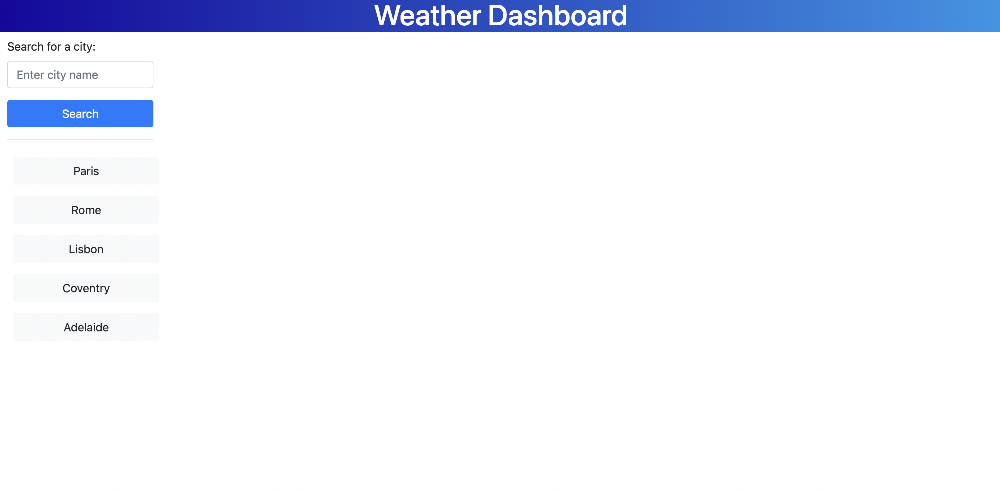
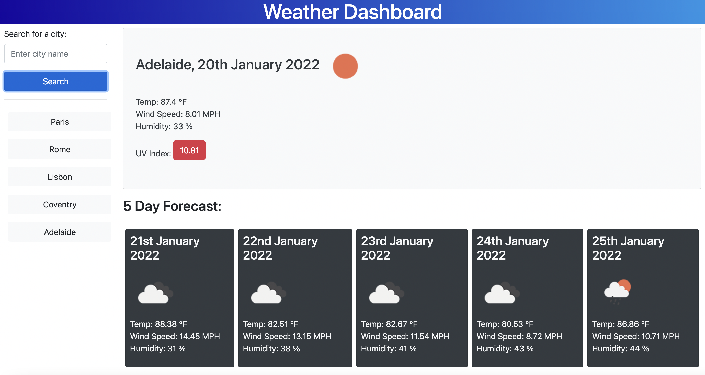

# weather-dashboard

## Description

- The aim of this project is provide a dashboard that searches for the weather both for today and the next 5 days using an API. I have chosen to use the OpenWeatherMap API to provide the data and icons for the weather results.

- Users can both search for a new city or search for a city that has already been searched for from the corresponding button for that city in the search history.

- The weather data shows the city searched for, the date, the temperature, the wind speed, the humidity and for todays weather it also shows the UV Index. The UV index is color coded to low, moderate and severe.

- When a city is searched for it is added to the history bar and can then be searched for again in the future.

## Weather Dashboard

- Here is a link to the deployed project - [click here](https://danlawrence91.github.io/weather-dashboard/)

- This screenshot shows the page without a search and buttons in the searc history that allows a user to click to search for a city, or they can enter a city into the search bar:

- This is a screenshot showing how the data is displayed once a city has been searched for:

## Future Features

- Futures features could include a toggle between imperial and metric units on the weather data

- Another would be to have a clear button so that the search history does not become too long